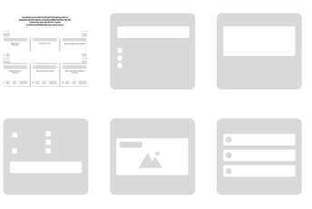
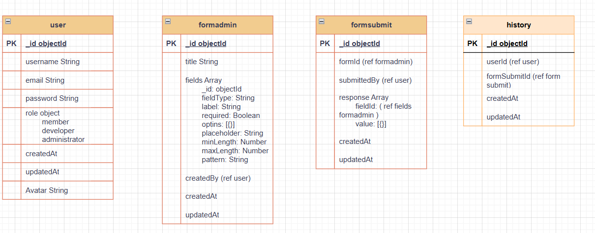

  # My Portfolio

## Introduction
นี่คือโปรเจกต์เกี่ยวกับการแนะนำตัวและการโชว์ผลงานตลอดระยะเวลาที่ได้ฝึกงาน 

## Get Started

### Clone Project
  1. Open Cmd (Command Line)
  2. git clone https://github.com/khampheeraphopIT/Portfolio.git
  3. cd Portfolio
  4. npm install
  5. code .
  6. open terminal
  7. npm run dev

## Project 1

(https://www.figma.com/proto/EF8oZiGtSl7X7Ox9v6qQrp/Design-User-Page?node-id=30-1737&starting-point-node-id=30%3A1737&scaling=scale-down-width&content-scaling=fixed)

เป็นผลงานแรกที่ได้รับมอบหมาย ให้ออกแบบหน้าเว็บไซต์สำหรับ Form Builder เพื่อนำไปเขียนโค้ดใช้งานจริง

## Project 2

(https://drive.google.com/file/d/1dNFGS5vkTTaulUqe-8VCAIZCSTyZwF-j/view?usp=sharing)

เป็นผลงานที่สองที่ได้รับมอบหมาย ให้ออกแบบER-Diagram Form Builder เพื่อนำไปเขียนโค้ดสร้างฐานข้อมูล และการสร้าง API

## Project 3

(https://www.figma.com/proto/y6FCcwjeCfuCat6PTp9L1v/Work-3?node-id=1-2&t=txAnCnfEKNOJjsF3-0&scaling=min-zoom&content-scaling=fixed&page-id=0%3A1)

เป็นผลงานที่สามที่ได้รับมอบหมาย ให้เขียนโค้ดสร้าง Website Form Builder ได้ลองสร้าง Slider Pagination ได้สร้างฟังก์ชันที่ไม่เคยได้สร้างมาก่อน และได้ทำเว็บไซต์จริงด้วย TypeScript React และ Material UI